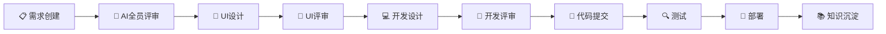
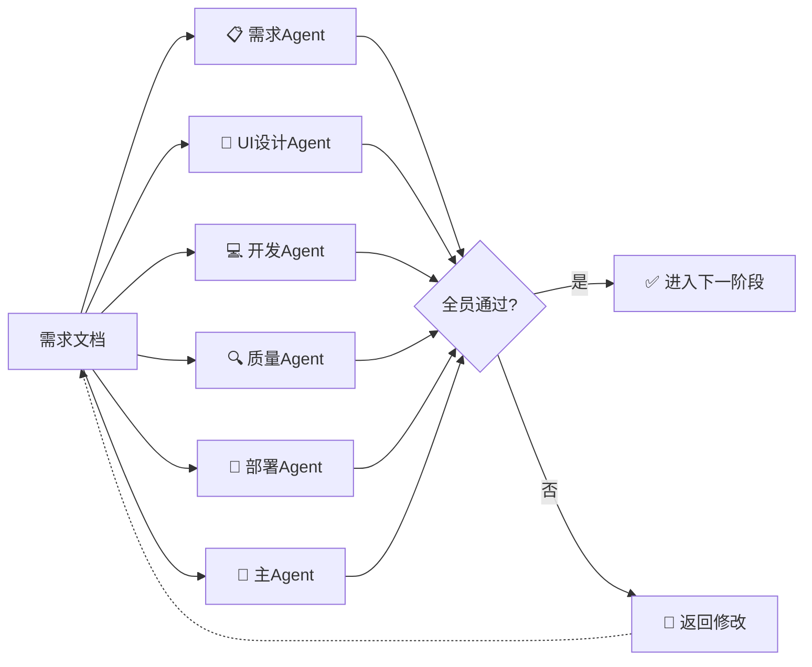
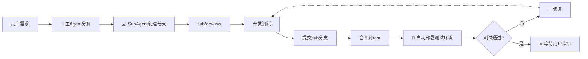
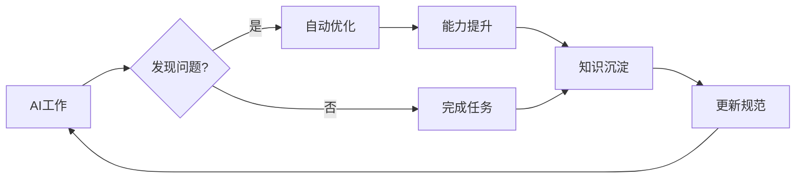

# 工作流Skill文档

**版本**：v1.0
**更新**：2026-03-27

---

## 一、AI角色

| 角色 | 标识 | 职责 |
|------|------|------|
| 主Agent | 🤖 | 总指挥、任务分解、进度监控 |
| 需求Agent | 📋 | 需求分析、需求建模 |
| UI设计Agent | 🎨 | 界面设计、交互设计 |
| 开发Agent | 💻 | 架构设计、代码实现 |
| 质量Agent | 🔍 | 测试用例、测试验证 |
| 部署Agent | 🚀 | 环境部署、版本发布 |
| 知识管理Agent | 📚 | 文档整理、经验总结 |

---

## 二、工作流10阶段



---

## 三、状态展示格式

每次输出必须展示：

```markdown
━━━━━━━━━━━━━━━━━━━━━━━━━━━━━━━━━━━━━━━━━━━━━━
👤 当前Agent：💻 开发Agent
🔄 活跃SubAgent：2/3
━━━━━━━━━━━━━━━━━━━━━━━━━━━━━━━━━━━━━━━━━━━━━━

## 📊 当前进度

[████████░░░░░░░░░░░░░░░░░░░░] 35% (7/20)

## ✅ 已完成
- Task 1: 需求创建 [完成]

## 🔄 进行中
- Task 2: 代码开发 [开发Agent执行中]

## ⏳ 待执行
- Task 3: 测试验证 [等待]
```

---

## 四、评审机制

### 4.1 AI全员评审

**评审参与**：需求Agent、UI设计Agent、开发Agent、质量Agent、部署Agent、主Agent

**通过标准**：所有Agent都输出"通过"

**不通过处理**：返回修改 → 重新评审



### 4.2 评审视角

| Agent | 评审视角 |
|-------|----------|
| 需求Agent | 需求完整性 |
| UI设计Agent | 设计可行性 |
| 开发Agent | 技术可行性 |
| 质量Agent | 测试可行性 |
| 部署Agent | 部署可行性 |
| 主Agent | 综合评估 |

---

## 五、Git分支策略



### 分支命名

- `main` - 生产环境
- `test` - 测试环境
- `sub/<Agent>/<任务>` - SubAgent开发分支

### 强制规则

- ⚠️ 没有用户允许，禁止上传代码到远程分支
- ⚠️ 没有用户指令，禁止合并到main
- ⚠️ 合并到main时，版本号+0.0.1

---

## 六、必须用户参与的环节（仅2个）

| 环节 | 用户操作 |
|------|----------|
| **合并到main** | 发送指令："合并到main" |
| **部署生产** | 发送指令："部署生产" |

---

## 七、自我进化机制

### 7.1 能力进化循环



### 7.2 自动发现问题

AI在执行任务时自动检测：

| 检测项 | 处理方式 |
|--------|----------|
| 系统缺陷 | 创建优化需求 |
| 流程缺陷 | 优化规范流程 |
| 代码缺陷 | 自动修复+记录 |
| 知识缺失 | 补充文档 |

### 7.3 知识产出要求

每次工作必须产出：

| 类型 | 说明 |
|------|------|
| 代码 | 完成的代码 |
| 文档 | 相关文档 |
| 经验 | 遇到的问题和解决方案 |

---

## 八、输出规范

### 8.1 头部

```markdown
━━━━━━━━━━━━━━━━━━━━━━━━━━━━━━━━━━━━━━━━━━━━━━
👤 当前Agent：[当前Agent名称]
🔄 活跃SubAgent：[当前/总数]
━━━━━━━━━━━━━━━━━━━━━━━━━━━━━━━━━━━━━━━━━━━━━━
```

### 8.2 进度

```markdown
## 📊 当前进度
[████████░░░░░░░░░░░░░░░░░░░░] XX% (X/X)

## ✅ 已完成
## 🔄 进行中
## ⏳ 待执行
```

### 8.3 关键节点

```markdown
━━━━━━━━━━━━━━━━━━━━━━━━━━━━━━━━━━━━━━━━━━━━━━
🎉 阶段完成：[阶段名称]

🔜 等待用户指令：合并到main
━━━━━━━━━━━━━━━━━━━━━━━━━━━━━━━━━━━━━━━━━━━━━━
```

---

**最后更新**：2026-03-27
