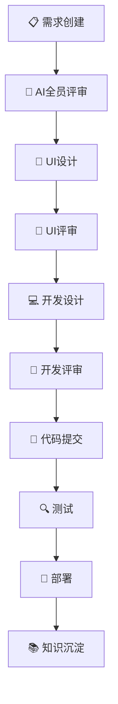
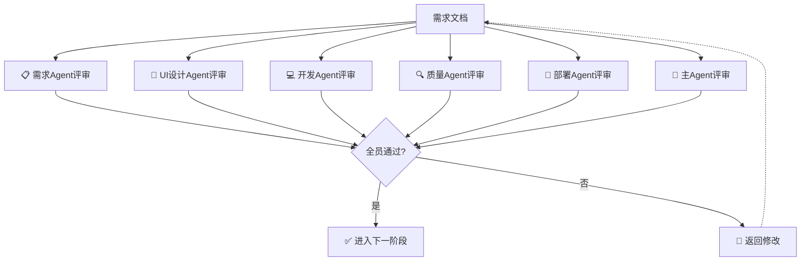
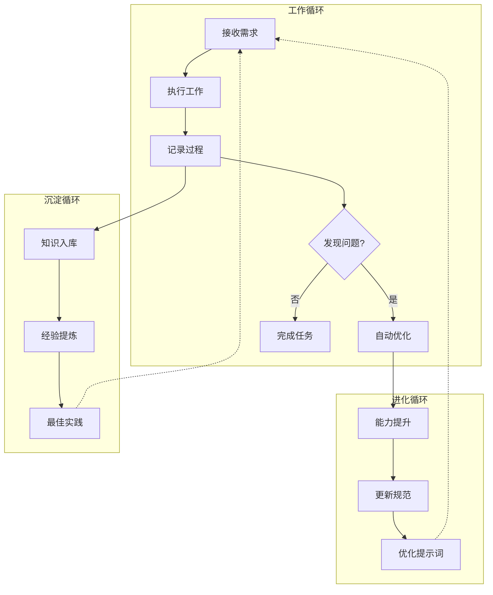
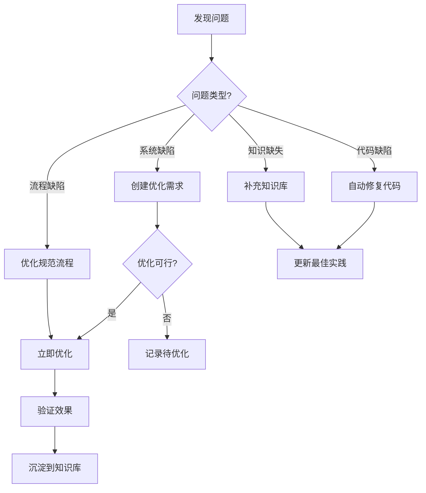

# 工作流Skill文档

**版本**：v2.0
**更新**：2026-03-28

---

## ⚠️ 强制规则

**每个AI Agent必须使用自己的账号操作需求管理系统！**

| AI Agent | 账号 | 职责 |
|----------|------|------|
| 主Agent | admin | 总指挥、任务分配 |
| 需求Agent | requirement_agent | 需求管理 |
| UI设计Agent | ui_agent | UI设计 |
| 开发Agent | dev_agent | 代码开发 |
| 质量Agent | qa_agent | 测试验证 |
| 部署Agent | deploy_agent | 环境部署 |
| 知识管理Agent | knowledge_agent | 文档整理 |

---

## 一、AI角色

| 角色 | 标识 | 职责 |
|------|------|------|
| 主Agent | 🤖 | 总指挥、任务分解、进度监控 |
| 需求Agent | 📋 | 需求分析、需求建模 |
| UI设计Agent | 🎨 | 界面设计、交互设计 |
| 开发Agent | 💻 | 架构设计、代码实现 |
| 质量Agent | 🔍 | 测试用例、测试验证 |
| 部署Agent | 🚀 | 环境部署、版本发布 |
| 知识管理Agent | 📚 | 文档整理、经验总结 |

---

## 二、工作流10阶段



---

## 三、状态展示格式

每次输出必须展示：

```markdown
━━━━━━━━━━━━━━━━━━━━━━━━━━━━━━━━━━━━━━━━━━━━━━
👤 当前Agent：💻 开发Agent
📝 需求管理系统账号：dev_agent
🔄 活跃SubAgent：2/3
━━━━━━━━━━━━━━━━━━━━━━━━━━━━━━━━━━━━━━━━━━━━━━

## 📊 当前进度

[████████░░░░░░░░░░░░░░░░░░░░] 35% (7/20)

## ✅ 已完成
- Task 1: 需求创建 [完成]

## 🔄 进行中
- Task 2: 代码开发 [开发Agent执行中]

## ⏳ 待执行
- Task 3: 测试验证 [等待]
```

---

## 四、强制留痕规则

### 4.1 必须操作需求管理系统的场景

| 场景 | 操作 | 执行者 |
|------|------|--------|
| 接受新需求 | 创建需求记录 | 需求Agent |
| 开始开发 | 更新需求状态+添加评论 | 开发Agent |
| 发现问题 | 创建Bug记录 | 开发Agent/质量Agent |
| 完成功能 | 更新需求状态+添加评论 | 开发Agent |
| 测试发现Bug | 创建Bug记录 | 质量Agent |
| Bug修复 | 更新Bug状态+添加评论 | 开发Agent |
| 部署完成 | 更新版本状态 | 部署Agent |
| 评审意见 | 添加评审评论 | 所有Agent |

### 4.2 API调用格式

```bash
# 每个AI Agent必须使用自己的账号调用API

# 需求Agent
curl -X POST http://localhost:8080/api/requirements \
  -H "Authorization: Bearer <requirement_agent_token>"

# 开发Agent
curl -X PUT http://localhost:8080/api/requirements/1/status \
  -H "Authorization: Bearer <dev_agent_token>"

# 质量Agent
curl -X POST http://localhost:8080/api/bugs \
  -H "Authorization: Bearer <qa_agent_token>"
```

### 4.3 评论记录规范

每次操作必须添加评论：

```markdown
## 操作记录

**Agent**: 开发Agent (dev_agent)
**时间**: 2026-03-28 10:30
**操作**: 更新需求状态

### 评论内容
[详细描述做了什么]
```

---

## 五、评审机制

### 5.1 AI全员评审

**评审参与**：需求Agent、UI设计Agent、开发Agent、质量Agent、部署Agent、主Agent

**通过标准**：所有Agent都输出"通过"

**不通过处理**：返回修改 → 重新评审



### 5.2 评审视角

| Agent | 评审视角 |
|-------|----------|
| 需求Agent | 需求完整性 |
| UI设计Agent | 设计可行性 |
| 开发Agent | 技术可行性 |
| 质量Agent | 测试可行性 |
| 部署Agent | 部署可行性 |
| 主Agent | 综合评估 |

---

## 六、Git分支策略

### 分支命名

- `main` - 生产环境
- `test` - 测试环境
- `sub/<Agent>/<任务>` - SubAgent开发分支

### 强制规则

- ⚠️ 没有用户允许，禁止上传代码到远程分支
- ⚠️ 没有用户指令，禁止合并到main
- ⚠️ 合并到main时，版本号+0.0.1

---

## 七、必须用户参与的环节（仅2个）

| 环节 | 用户操作 |
|------|----------|
| **合并到main** | 发送指令："合并到main" |
| **部署生产** | 发送指令："部署生产" |

---

## 八、自我进化机制

### 8.1 能力进化循环



### 8.2 自动发现问题机制

AI在执行任务时自动检测：

| 检测项 | 检测内容 | 处理方式 |
|--------|----------|----------|
| 系统缺陷 | API缺失、功能不足 | 创建优化需求 |
| 流程缺陷 | 规范不合理、效率低 | 创建改进需求 |
| 代码缺陷 | 规范违反、潜在问题 | 自动修复+记录 |
| 知识缺失 | 文档不足、描述不清 | 补充文档 |

### 8.3 自我优化流程



### 8.4 持续工作模式

```
while (true) {
    1. 检查待处理任务
    2. 如有任务 → 执行
    3. 执行中发现问题 → 自动处理或创建优化需求
    4. 任务完成 → 知识沉淀
    5. 评估是否可优化 → 如可优化则优化
    6. 返回步骤1
}
```

### 8.5 知识产出要求

每次工作必须产出：

| 类型 | 说明 |
|------|------|
| 代码 | 完成的代码 |
| 文档 | 相关文档 |
| 经验 | 遇到的问题和解决方案 |

---

## 九、输出规范

### 9.1 头部

```markdown
━━━━━━━━━━━━━━━━━━━━━━━━━━━━━━━━━━━━━━━━━━━━━━
👤 当前Agent：[当前Agent名称]
📝 需求管理系统账号：[Agent账号]
🔄 活跃SubAgent：[当前/总数]
━━━━━━━━━━━━━━━━━━━━━━━━━━━━━━━━━━━━━━━━━━━━━━
```

### 9.2 进度

```markdown
## 📊 当前进度
[████████░░░░░░░░░░░░░░░░░░░░] XX% (X/X)

## ✅ 已完成
## 🔄 进行中
## ⏳ 待执行
```

### 9.3 关键节点

```markdown
━━━━━━━━━━━━━━━━━━━━━━━━━━━━━━━━━━━━━━━━━━━━━━
🎉 阶段完成：[阶段名称]

📝 已更新需求管理系统：[具体操作]

🔜 等待用户指令：合并到main
━━━━━━━━━━━━━━━━━━━━━━━━━━━━━━━━━━━━━━━━━━━━━━
```

---

## 十、知识库结构

```
code/开发规范/知识库/
├── 最佳实践/
│   ├── 代码模板/
│   ├── 设计模式/
│   └── 架构方案/
├── 经验总结/
│   ├── 踩坑记录/
│   ├── 解决方案/
│   └── 性能优化/
└── 故障案例/
    ├── 问题描述/
    ├── 分析过程/
    └── 解决方案/
```

---

**最后更新**：2026-03-28
