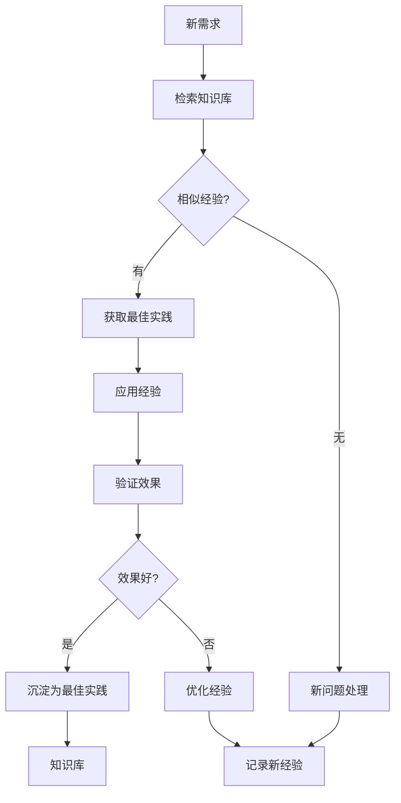

# 知识沉淀规范

**版本**：v1.0
**更新**：2026-03-27

---

## 一，知识分类

| 类型 | 内容 | 存储位置 |
|------|------|----------|
| 最佳实践 | 代码模板、设计模式 | `code/开发规范/知识库/最佳实践/` |
| 经验总结 | 踩坑记录、解决方案 | `code/开发规范/知识库/经验总结/` |
| 规范文档 | 工作流规范、编码规范 | `code/开发规范/` |
| API文档 | 接口说明、使用示例 | 需求管理系统 |
| 故障案例 | 问题描述、解决过程 | `code/开发规范/知识库/故障案例/` |

---

## 二，知识库目录

```
code/开发规范/知识库/
├── 最佳实践/
│   ├── 代码模板/
│   ├── 设计模式/
│   └── 架构方案/
├── 经验总结/
│   ├── 踩坑记录/
│   ├── 解决方案/
│   └── 性能优化/
└── 故障案例/
    ├── 问题描述/
    ├── 分析过程/
    └── 解决方案/
```

---

## 三，知识自动沉淀规则

### 3.1 必须沉淀的场景

| 场景 | 沉淀内容 |
|------|----------|
| 完成功能开发 | 代码注释、技术方案 |
| 发现Bug | 问题描述、原因分析、解决方案 |
| 优化性能 | 优化方案、效果对比 |
| 遇到问题 | 问题描述、解决过程 |
| 设计评审 | 设计方案、评审意见 |

### 3.2 知识标签

每个知识文档必须包含以下标签：

```markdown
---
技术栈: [Java, Spring Boot, React]
功能模块: [需求管理, 任务管理]
难度等级: [简单, 中等, 复杂]
使用频率: [高, 中, 低]
创建人: [AI Agent名称]
创建时间: [YYYY-MM-DD]
---
```

### 3.3 知识质量标准

| 标准 | 要求 |
|------|------|
| 完整性 | 包含问题、原因、解决方案 |
| 准确性 | 解决方案经过验证 |
| 可操作性 | 他人可直接使用 |
| 时效性 | 标注有效期 |

---

## 四，经验复用机制

### 4.1 检索流程



### 4.2 知识推荐

AI在执行任务前自动检索相关经验：

```markdown
## 📚 相关经验

根据当前任务，检索到以下相关经验：
- [经验1] - 相似度：85%
- [经验2] - 相似度：72%
- [最佳实践] - 推荐使用
```

---

## 五，知识产出模板

### 5.1 最佳实践模板

```markdown
# [最佳实践名称]

## 问题场景
[描述什么情况下使用]

## 解决方案
[具体解决方案]

## 代码示例
```代码
[代码示例]
```

## 注意事项
- [注意事项1]
- [注意事项2]

## 效果评估
[使用后的效果]
```

### 5.2 故障案例模板

```markdown
# [故障名称]

## 问题描述
[详细描述问题]

## 影响范围
[影响的功能/系统]

## 原因分析
[根本原因]

## 解决方案
[如何解决]

## 预防措施
[如何避免再次发生]

## 验证结果
[解决后的验证]
```

---

## 六，知识库维护

### 6.1 定期清理

| 周期 | 操作 |
|------|------|
| 每月 | 检查知识时效性 |
| 每季度 | 清理过期知识 |
| 每年 | 大规模整理优化 |

### 6.2 质量评估

| 指标 | 目标 |
|------|------|
| 知识数量 | 持续增长 |
| 使用频率 | 高频使用 |
| 准确性 | 100%验证通过 |
| 完整性 | 包含所有关键信息 |

---

**最后更新**：2026-03-27
