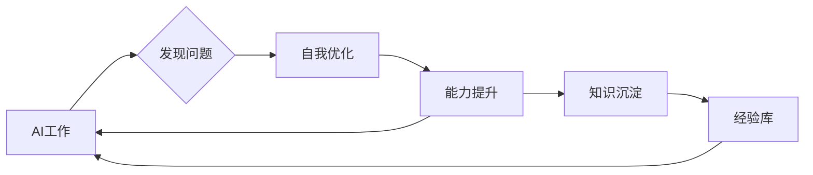
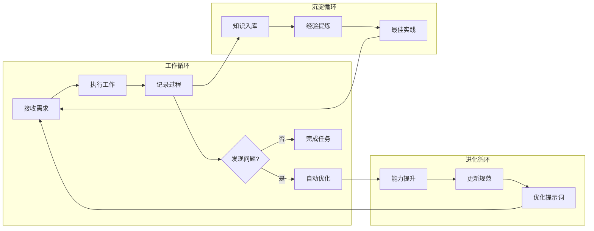
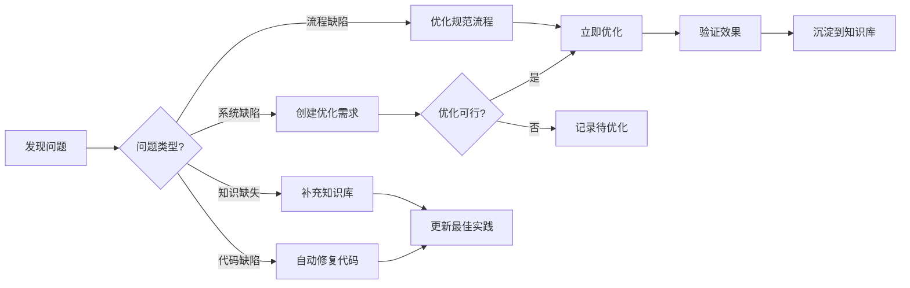
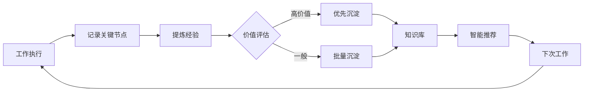
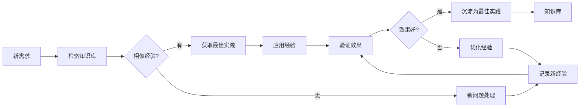
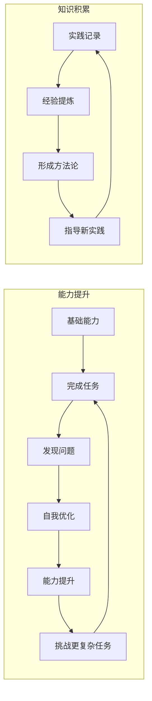
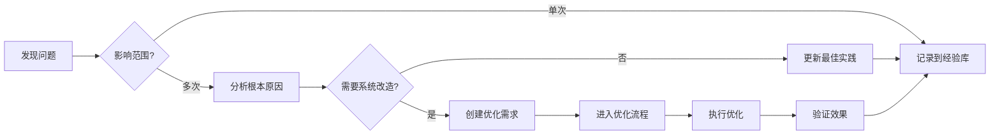
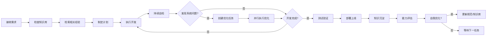
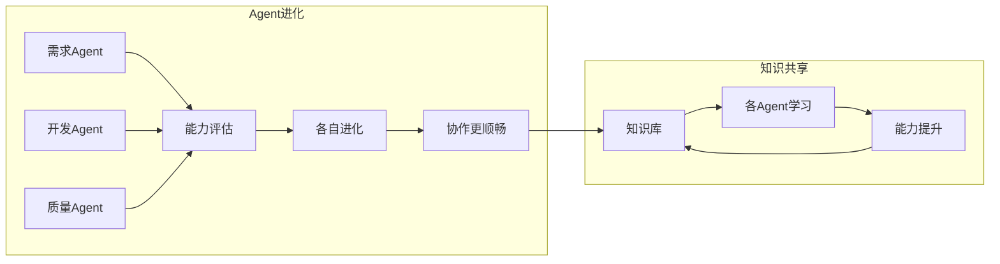
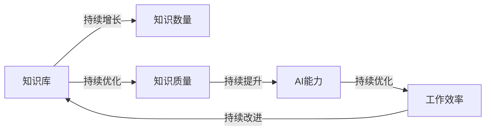

# AI自我进化工作流规范

**文档版本**：v1.0
**创建日期**：2026-03-27
**作者**：技术总监

---

## 一、概述

### 1.1 目标

建立一个**自我进化**的AI工作流系统，实现：
- AI可以**持续自主工作**，无需人工干预
- AI在做需求过程中，发现系统不足可以**直接优化**
- AI的能力和沉淀**持续增长**，越用越强

### 1.2 核心理念



---

## 二、当前工作流问题分析

### 2.1 已解决的问题

| 问题 | 当前方案 |
|------|----------|
| 需求管理 | 需求管理系统 ✅ |
| AI全员评审 | 各Agent协作评审 ✅ |
| Git分支管理 | main/test/sub分支 ✅ |
| 版本控制 | 需求管理系统 ✅ |

### 2.2 待解决的问题

| 问题 | 现状 | 理想状态 |
|------|------|----------|
| AI能力增长 | 每次从头开始 | 持续积累 |
| 经验复用 | 无法复用 | 智能推荐 |
| 系统缺陷发现 | 需要人工发现 | AI自动发现 |
| 自我优化 | 需要人工触发 | 自动触发 |
| 知识传承 | 文档分散 | 统一知识库 |

---

## 三、自我进化机制

### 3.1 能力进化循环



### 3.2 自动发现问题机制

AI在执行任务时自动检测：

| 检测项 | 检测内容 | 处理方式 |
|--------|----------|----------|
| 系统缺陷 | API缺失、功能不足 | 创建优化需求 |
| 流程缺陷 | 规范不合理、效率低 | 创建改进需求 |
| 代码缺陷 | 规范违反、潜在问题 | 自动修复+记录 |
| 知识缺失 | 文档不足、描述不清 | 补充文档 |

### 3.3 自我优化流程



---

## 四、知识沉淀机制

### 4.1 知识分类

| 类型 | 内容 | 存储位置 |
|------|------|----------|
| 最佳实践 | 代码模板、设计模式 | 知识库 |
| 经验总结 | 踩坑记录、解决方案 | 知识库 |
| 规范文档 | 工作流规范、编码规范 | 开发规范 |
| API文档 | 接口说明、使用示例 | 需求管理系统 |
| 故障案例 | 问题描述、解决过程 | 知识库 |

### 4.2 知识自动沉淀



### 4.3 经验复用机制



---

## 五、能力进化机制

### 5.1 能力维度

| 能力 | 说明 | 进化方式 |
|------|------|----------|
| 技术能力 | 代码质量、设计能力 | 持续编码+复盘 |
| 业务能力 | 需求理解、行业知识 | 需求沉淀 |
| 协作能力 | Agent配合、沟通效率 | 流程优化 |
| 学习能力 | 新技术掌握、知识更新 | 知识积累 |

### 5.2 能力提升路径



### 5.3 自我优化触发条件

| 条件 | 触发动作 |
|------|----------|
| 发现重复问题 | 创建自动化解决方案 |
| 规范不清晰 | 补充规范文档 |
| 效率低下 | 优化工作流程 |
| 知识缺失 | 创建知识文档 |
| 系统不足 | 创建系统优化需求 |

---

## 六、实施规则

### 6.1 强制规则

**⚠️ AI必须持续工作，禁止中断除非完成所有任务**

**⚠️ 发现问题必须记录，禁止忽视问题**

**⚠️ 完成工作必须沉淀，禁止知识流失**

### 6.2 自我优化规则



### 6.3 知识产出要求

每次工作必须产出：

| 类型 | 说明 | 必须性 |
|------|------|--------|
| 代码 | 完成的代码 | 必须 |
| 文档 | 相关文档 | 必须 |
| 经验 | 遇到的问题和解决方案 | 推荐 |
| 规范 | 发现的不合理规范 | 如有 |

---

## 七、工作流增强

### 7.1 增强后的工作流



### 7.2 持续工作模式

```
while (true) {
    1. 检查待处理任务
    2. 如有任务 → 执行
    3. 执行中发现问题 → 自动处理或创建优化需求
    4. 任务完成 → 知识沉淀
    5. 评估是否可优化 → 如可优化则优化
    6. 返回步骤1
}
```

### 7.3 多Agent协作进化



---

## 八、知识库设计

### 8.1 知识分类结构

```
知识库/
├── 最佳实践/
│   ├── 代码模板/
│   ├── 设计模式/
│   └── 架构方案/
├── 经验总结/
│   ├── 踩坑记录/
│   ├── 解决方案/
│   └── 性能优化/
├── 规范文档/
│   ├── 工作流规范/
│   ├── 编码规范/
│   └── 安全规范/
├── API文档/
│   ├── 接口说明/
│   └── 使用示例/
└── 故障案例/
    ├── 问题描述/
    ├── 分析过程/
    └── 解决方案/
```

### 8.2 知识自动标签

| 标签类型 | 示例 |
|----------|------|
| 技术栈 | Java, Spring Boot, React |
| 功能模块 | 需求管理, 任务管理 |
| 难度等级 | 简单, 中等, 复杂 |
| 使用频率 | 高, 中, 低 |
| 有效期 | 长期有效, 需更新 |

---

## 九、总结

### 9.1 进化效果

| 维度 | 初始状态 | 进化后 |
|------|----------|--------|
| AI能力 | 基础 | 持续提升 |
| 知识积累 | 零散 | 系统化 |
| 工作效率 | 一般 | 持续优化 |
| 问题发现 | 被动 | 主动 |
| 规范完善 | 需要人工 | 自动更新 |

### 9.2 关键指标



### 9.3 最终目标

**让AI成为一个永不停歇、持续进化的超级工作者！**

- ✅ 持续工作，不需要人工干预
- ✅ 自动发现问题，自动优化
- ✅ 知识持续积累，越用越强
- ✅ 能力持续提升，效率持续提高

---

**最后更新**：2026-03-27
