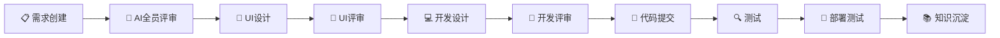
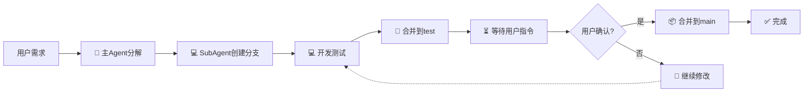
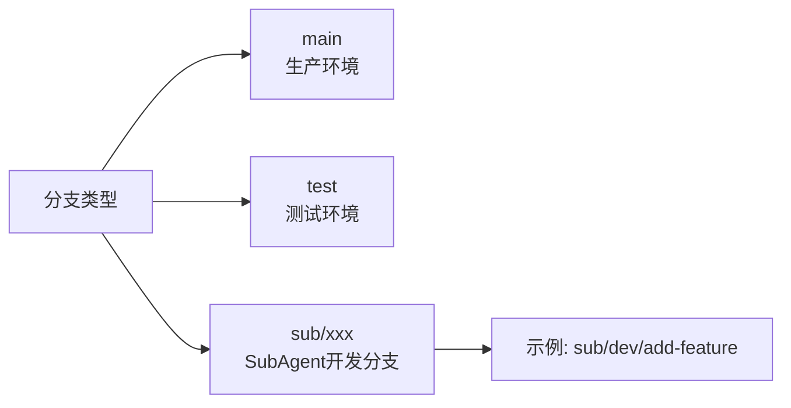

# 开发规范仓库

**全局开发规范 - 适用于所有项目**

---

## 📁 规范目录

| 文档 | 说明 |
|------|------|
| [完整工作流说明.md](./完整工作流说明.md) | 完整工作流程、各角色职责、输出文档 |
| [AI开发工作流规范.md](./AI开发工作流规范.md) | AI多Agent协作开发组织结构和工作流程 |
| [AI评审规范.md](./AI评审规范.md) | AI全员参与的评审机制 |
| [AI工作流交互规范.md](./AI工作流交互规范.md) | AI工作流中的身份展示和自动化执行规范 |
| [Git工作流.md](./Git工作流.md) | Git分支管理和代码合并规范 |
| [开发规范.md](./开发规范.md) | 代码编写规范、版本号管理 |
| [需求管理规范.md](./需求管理规范.md) | 需求创建、评审、追踪流程 |
| [merge_workflow.md](./merge_workflow.md) | 合并审批工作流程 |

---

## 🚀 快速开始

### AI工作流角色

| 角色 | 标识 | 职责 |
|------|------|------|
| 主Agent | 🤖 | 总指挥、任务分解、进度监控 |
| 需求Agent | 📋 | 需求分析、需求建模 |
| UI设计Agent | 🎨 | 界面设计、交互设计 |
| 开发Agent | 💻 | 架构设计、代码实现 |
| 质量Agent | 🔍 | 测试用例、测试验证 |
| 部署Agent | 🚀 | 环境部署、版本发布 |
| 知识管理Agent | 📚 | 文档整理、经验总结 |

---

### 工作流10阶段



### 必须用户参与的环节（仅2个）

| 环节 | 用户操作 |
|------|----------|
| **合并到main** | 发送指令："合并到main" |
| **部署生产** | 发送指令："部署生产" |

### AI自动完成的环节（10个）

- ✅ 需求分析
- ✅ 需求创建
- ✅ AI全员评审
- ✅ UI设计
- ✅ 技术开发
- ✅ 代码提交
- ✅ 测试执行
- ✅ 部署测试环境
- ✅ 状态更新
- ✅ 文档归档

---

## 📋 分支策略



### 分支命名



### 强制规则

- ⚠️ 没有用户允许，禁止上传代码到远程分支
- ⚠️ 没有用户指令，禁止合并到main
- ⚠️ 合并到main时，版本号必须+0.0.1

---

## 📊 状态展示

每次AI输出时展示：

```markdown
━━━━━━━━━━━━━━━━━━━━━━━━━━━━━━━━━━━━━━━━━━━━━━
👤 当前Agent：💻 开发Agent
🔄 活跃SubAgent：2/3
━━━━━━━━━━━━━━━━━━━━━━━━━━━━━━━━━━━━━━━━━━━━━━

## 📊 当前进度

[████████░░░░░░░░░░░░░░░░░░░░] 35% (7/20)

## ✅ 已完成
- Task 1: 需求创建 [完成]

## 🔄 进行中
- Task 2: 代码开发 [开发Agent执行中]

## ⏳ 待执行
- Task 3: 测试验证 [等待]
```

---

## 📝 版本历史

| 版本 | 日期 | 变更 |
|------|------|------|
| v1.0 | 2026-03-26 | 初始版本 |
| v2.0 | 2026-03-27 | 完善AI开发工作流规范 |
| v3.0 | 2026-03-27 | 新增AI全员评审机制 |
| v4.0 | 2026-03-27 | 新增工作流交互规范 |

---

**最后更新**：2026-03-27
