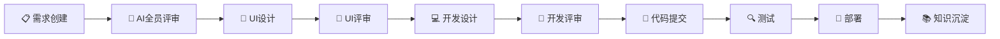
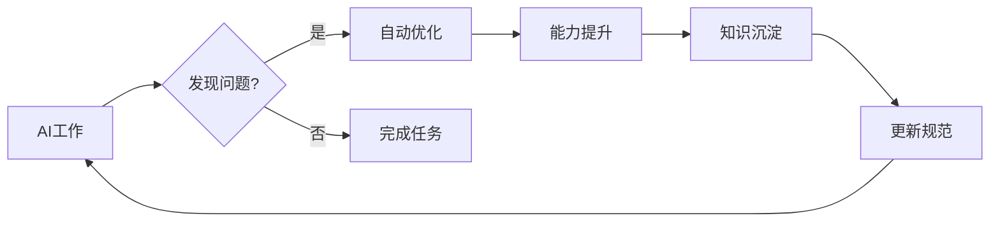

# 开发规范仓库

**全局开发规范 - 适用于所有项目**

---

## 📁 规范目录

| 文档 | 说明 |
|------|------|
| [01-工作流Skill.md](./01-工作流Skill.md) | 整合的工作流文档 |
| [02-知识沉淀.md](./02-知识沉淀.md) | 知识沉淀规范 |
| [03-项目规则.md](./03-项目规则.md) | 项目规则 |

---

## 🚀 快速开始

### AI角色

| 角色 | 标识 | 职责 |
|------|------|------|
| 主Agent | 🤖 | 总指挥 |
| 需求Agent | 📋 | 需求分析 |
| UI设计Agent | 🎨 | 界面设计 |
| 开发Agent | 💻 | 代码开发 |
| 质量Agent | 🔍 | 测试验证 |
| 部署Agent | 🚀 | 环境部署 |
| 知识管理Agent | 📚 | 文档整理 |

### 工作流10阶段



### 状态展示

```markdown
━━━━━━━━━━━━━━━━━━━━━━━━━━━━━━━━━━━━━━━━━━━━━━
👤 当前Agent：💻 开发Agent
🔄 活跃SubAgent：2/3
━━━━━━━━━━━━━━━━━━━━━━━━━━━━━━━━━━━━━━━━━━━━━━
```

---

## 📋 分支策略

```
main    → 生产环境（用户指令合并）
test    → 测试环境
sub/*   → SubAgent开发分支
```

### 强制规则

- ⚠️ 没有用户允许，禁止上传代码到远程分支
- ⚠️ 没有用户指令，禁止合并到main
- ⚠️ 合并到main时，版本号+0.0.1

---

## ⚠️ 必须用户参与的环节（仅2个）

| 环节 | 用户操作 |
|------|----------|
| **合并到main** | 发送指令："合并到main" |
| **部署生产** | 发送指令："部署生产" |

---

## 🔄 自我进化



---

## 📝 版本历史

| 版本 | 日期 | 变更 |
|------|------|------|
| v1.0 | 2026-03-27 | 整合为3个核心文档 |

---

**最后更新**：2026-03-27
