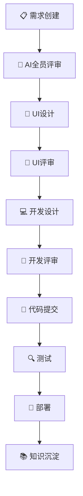
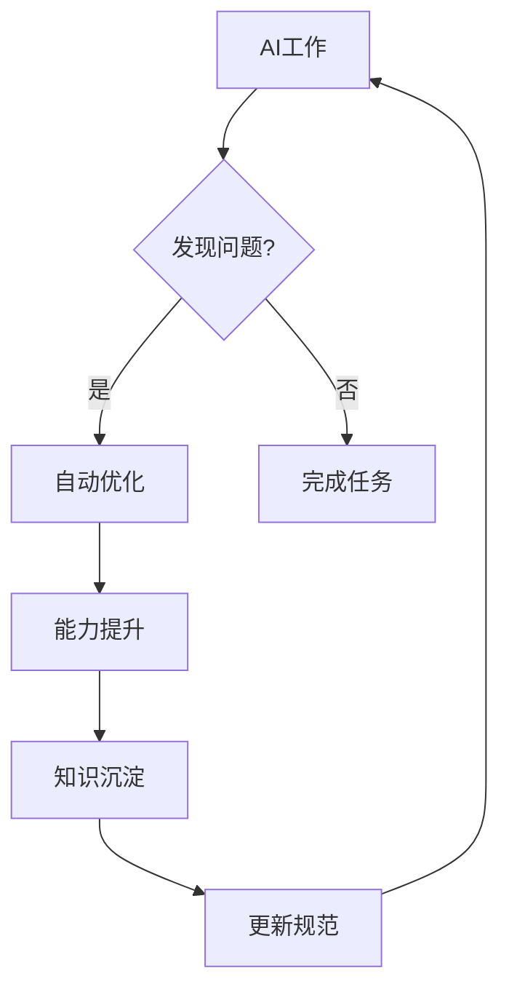

# 开发规范仓库

**全局开发规范 - 适用于所有项目**

---

## 📁 规范目录

| 文档 | 说明 |
|------|------|
| [01-CEO-Skill.md](./01-CEO-Skill.md) | CEO技能，确保工作流正确执行 |
| [01-工作流Skill.md](./01-工作流Skill.md) | 完整工作流规范 |
| [02-知识沉淀.md](./02-知识沉淀.md) | 知识沉淀规范 |
| [03-项目规则.md](./03-项目规则.md) | 项目规则 |
| [需求写作规范.md](./需求写作规范.md) | 需求写作规范 |

---

## 🚀 快速开始

### AI角色

| 角色 | 标识 | 职责 |
|------|------|------|
| CEO (主Agent) | 🤖 | 主导对话，调用工作流，协调Agent |
| 需求Agent | 📋 | 需求分析 |
| UI设计Agent | 🎨 | 界面设计 |
| 开发Agent | 💻 | 代码开发 |
| 质量Agent | 🔍 | 测试验证 |
| 部署Agent | 🚀 | 环境部署 |
| 知识管理Agent | 📚 | 文档整理 |

### CEO职责

1. **每次对话**都必须调用工作流
2. **协调**各岗位Agent密切合作
3. **监控**任务进度和质量
4. **汇报**用户执行结果

### 工作流10阶段



### 状态展示

```markdown
━━━━━━━━━━━━━━━━━━━━━━━━━━━━━━━━━━━━━━━━━━━━━━
🤖 CEO (主Agent)
📋 当前阶段：💻 开发设计
🔄 活跃SubAgent：2/3
📝 需求管理系统：已更新
━━━━━━━━━━━━━━━━━━━━━━━━━━━━━━━━━━━━━━━━━━━━━━
```

---

## ⚠️ 强制规则

- ⚠️ 每次对话必须调用01-工作流Skill
- ⚠️ 每个AI Agent必须使用自己的账号
- ⚠️ 所有操作必须更新需求管理系统
- ⚠️ 没有用户允许，禁止合并到main

---

## 🔄 自我进化



---

## 📝 版本历史

| 版本 | 日期 | 变更 |
|------|------|------|
| v1.0 | 2026-03-27 | 初始版本 |
| v2.0 | 2026-03-28 | 新增CEO技能，整合自我进化 |

---

**最后更新**：2026-03-28
