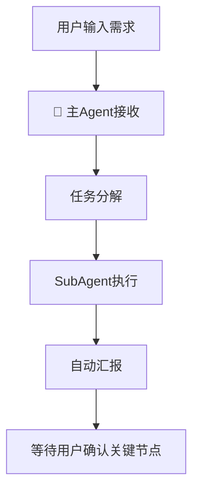
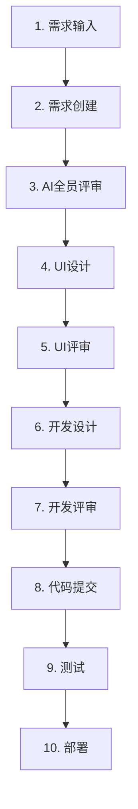
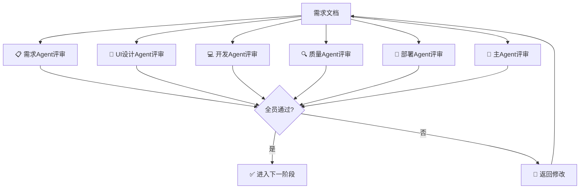
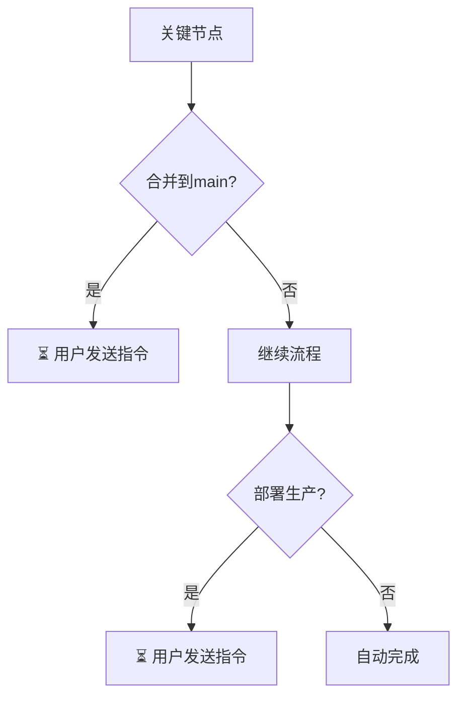
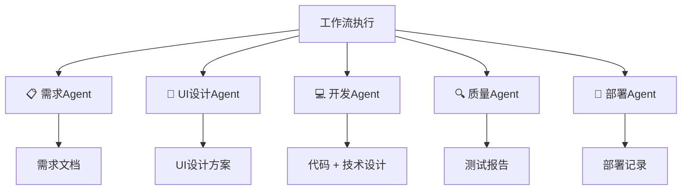
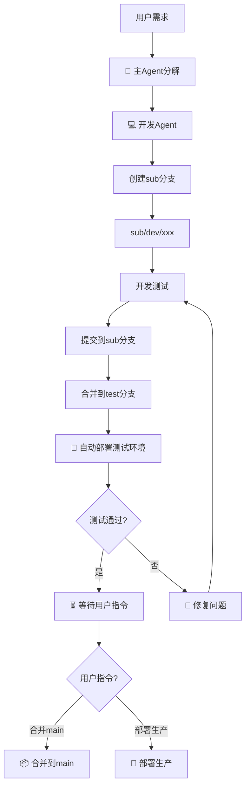
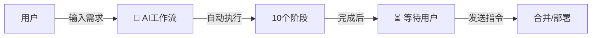

# 完整AI开发工作流说明

**文档版本**：v1.0
**创建日期**：2026-03-27
**作者**：技术总监

---

## 一、工作流概览



---

## 二、角色定义

### 2.1 AI角色

| 角色 | 标识 | 职责 | 权限 |
|------|------|------|------|
| 主Agent | 🤖 | 总指挥、任务分解、进度监控 | 任务分配、进度汇报 |
| 需求Agent | 📋 | 需求分析、需求建模 | 创建/更新需求 |
| UI设计Agent | 🎨 | 界面设计、交互设计 | 添加设计说明 |
| 开发Agent | 💻 | 架构设计、代码实现 | 代码开发、创建Bug |
| 质量Agent | 🔍 | 测试用例、测试验证 | 创建/验证Bug |
| 部署Agent | 🚀 | 环境部署、版本发布 | 更新版本状态 |
| 知识管理Agent | 📚 | 文档整理、经验总结 | 记录项目总结 |

### 2.2 人类角色

| 角色 | 职责 | 必须参与环节 |
|------|------|-------------|
| **用户（您）** | 最终决策者 | 合并main、部署生产、需求变更确认 |

---

## 三、工作流阶段



### 阶段1：需求输入

| 项目 | 说明 |
|------|------|
| **输入** | 用户描述需求 |
| **执行者** | 主Agent |
| **输出** | 需求分析文档 |
| **自动/手动** | 🤖 自动 |
| **用户参与** | ❌ 不需要 |

### 阶段2：需求创建

| 项目 | 说明 |
|------|------|
| **输入** | 用户需求 |
| **执行者** | 需求Agent |
| **输出** | 需求文档（PRD-XXXX） |
| **自动/手动** | 🤖 自动 |
| **用户参与** | ❌ 不需要 |

### 阶段3：AI全员评审



| 项目 | 说明 |
|------|------|
| **输入** | 需求文档 |
| **执行者** | 所有AI Agent |
| **输出** | 评审报告 |
| **通过标准** | 所有Agent都输出"通过" |

### 阶段4-10：其余阶段

| 阶段 | 执行者 | 说明 |
|------|--------|------|
| 4. UI设计 | 🎨 UI设计Agent | 界面设计 |
| 5. UI评审 | 所有Agent | UI方案评审 |
| 6. 开发设计 | 💻 开发Agent | 技术方案设计 |
| 7. 开发评审 | 所有Agent | 代码评审 |
| 8. 代码提交 | 💻 开发Agent | Git操作 |
| 9. 测试 | 🔍 质量Agent | 功能测试 |
| 10. 部署 | 🚀 部署Agent | 环境部署 |

---

## 四、必须用户参与环节



| 环节 | 原因 | 用户操作 |
|------|------|----------|
| **合并到main** | 生产环境代码变更 | 发送指令："合并到main" |
| **部署生产** | 正式环境变更 | 发送指令："部署生产" |
| **需求重大变更** | 范围调整 | 确认新的需求范围 |

---

## 五、AI自动完成环节

| 环节 | 说明 |
|------|------|
| ✅ 需求分析 | 需求Agent自动分析 |
| ✅ 需求创建 | 在需求管理系统中创建 |
| ✅ AI全员评审 | 所有Agent自动评审 |
| ✅ UI设计 | UI设计Agent自动设计 |
| ✅ 技术开发 | 开发Agent自动编码 |
| ✅ 代码提交 | 自动Git操作 |
| ✅ 测试执行 | 质量Agent自动测试 |
| ✅ 部署测试环境 | 部署Agent自动部署 |
| ✅ 状态更新 | 在需求管理系统中更新 |

---

## 六、输出文档清单



### 文档清单

| 文档 | 创建者 | 位置 |
|------|--------|------|
| 需求文档 | 需求Agent | 需求管理系统 |
| 评审报告 | 所有Agent | 需求管理系统评论 |
| UI设计方案 | UI设计Agent | 需求管理系统评论 |
| 技术设计 | 开发Agent | 代码注释/需求管理系统 |
| 测试报告 | 质量Agent | 需求管理系统 |
| 部署记录 | 部署Agent | 需求管理系统 |

---

## 七、Git分支流程



---

## 八、状态展示格式

### 头部展示

```markdown
━━━━━━━━━━━━━━━━━━━━━━━━━━━━━━━━━━━━━━━━━━━━━━
👤 当前Agent：💻 开发Agent
🔄 活跃SubAgent：3/5
━━━━━━━━━━━━━━━━━━━━━━━━━━━━━━━━━━━━━━━━━━━━━━
```

### 进度展示

```markdown
## 📊 当前进度

[████████░░░░░░░░░░░░░░░░░░░░] 35% (7/20)

## ✅ 已完成
- Task 1: 需求创建 [完成]
- Task 2: AI评审 [通过]

## 🔄 进行中
- Task 3: UI设计 [开发Agent执行中]

## ⏳ 待执行
- Task 4: 开发评审 [等待]
- Task 5: 代码提交 [等待]
```

---

## 九、总结

| 类型 | 数量 | 说明 |
|------|------|------|
| **AI自动完成** | 10个阶段 | 需求→评审→开发→测试→部署 |
| **用户参与** | 2个环节 | 合并main、部署生产 |
| **用户操作** | 发送指令 | "合并到main" |



**您只需要在关键节点发送简单指令，其余全部由AI工作流自动完成！**

---

**最后更新**：2026-03-27
