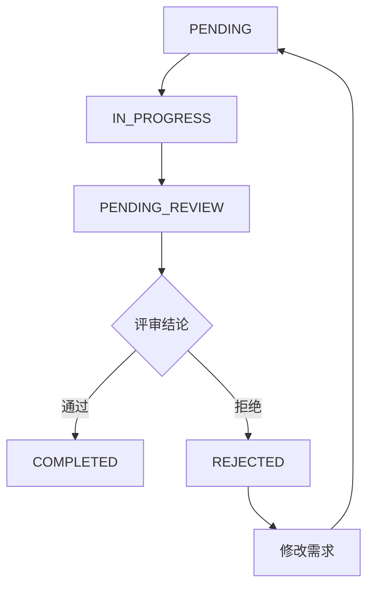

# 需求写作规范

**版本**：v1.0
**更新**：2026-03-28

---

## 一、需求文档结构

### 1.1 必须包含的部分

| 部分 | 说明 | 必须性 |
|------|------|--------|
| 需求背景 | 为什么要做这个需求 | 必须 |
| 功能需求 | 具体要做什么 | 必须 |
| 非功能需求 | 性能、安全等 | 推荐 |
| 验收标准 | 怎么算完成 | 必须 |
| 优先级 | 重要程度 | 必须 |

### 1.2 禁止在需求中包含的内容

| 内容 | 说明 | 禁止原因 |
|------|------|----------|
| 评审结论 | 应该写在评审记录中 | 评审结论属于过程记录 |
| 实现状态 | 应该用状态字段 | 状态是流转的，不是描述 |
| 开发过程 | 应该记录在评论中 | 需求只描述目标 |
| 代码实现 | 应该写在设计文档 | 需求不涉及实现细节 |

---

## 二、需求背景

### 2.1 结构

```markdown
## 需求背景

### 问题描述
[描述当前存在的问题]

### 影响范围
[描述问题造成的影响]

### 目标
[描述希望通过这个需求达成的目标]
```

### 2.2 示例

```markdown
## 需求背景

### 问题描述
当前需求管理系统无法完全支持AI工作流，存在以下问题：
1. 评审记录缺失 - AI全员评审无法结构化记录
2. 任务池缺失 - SubAgent无法领取任务
3. 操作日志缺失 - 无法追踪每个AI的操作
4. 知识库缺失 - 无法沉淀最佳实践

### 影响范围
- AI Agent无法有效协作
- 工作流程无法追踪
- 经验无法积累

### 目标
增强需求管理系统功能，使其完全支持AI工作流。
```

---

## 三、功能需求

### 3.1 结构

```markdown
## 功能需求

### 1. [模块名称]

| 功能 | 描述 | 优先级 |
|------|------|--------|
| [功能1] | [描述] | P0 |
| [功能2] | [描述] | P1 |

### 详细说明

#### 功能1
[详细描述功能1]

#### 功能2
[详细描述功能2]
```

### 3.2 示例

```markdown
## 功能需求

### 1. 评审记录模块

| 功能 | 描述 | 优先级 |
|------|------|--------|
| 评审发起 | 创建评审记录 | P0 |
| 评审意见 | 每个Agent提交评审意见 | P0 |
| 评审结论 | 汇总评审结论 | P0 |
| 评审历史 | 评审完整历史 | P1 |

### 详细说明

#### 评审发起
- 用户可以选择评审类型（需求评审、UI评审、开发评审）
- 系统自动记录评审发起人
- 评审状态初始为PENDING

#### 评审意见
- 每个Agent可以提交自己的评审意见
- 意见包含：评审视角、具体意见、评审结论
- 支持修改自己的评审意见

#### 评审结论
- 当所有Agent都提交意见后，主Agent汇总结论
- 结论为APPROVED或REJECTED
- REJECTED时需要填写修改意见
```

---

## 四、验收标准

### 4.1 结构

```markdown
## 验收标准

### 功能验收

- [ ] [功能点1] 可正常使用
- [ ] [功能点2] 可正常使用

### 性能验收

- [ ] API响应时间 < 200ms
- [ ] 支持100+并发

### 安全验收

- [ ] 权限控制正常
- [ ] 敏感数据加密
```

---

## 五、状态管理

### 5.1 需求状态流转



### 5.2 状态说明

| 状态 | 说明 |
|------|------|
| PENDING | 待处理 |
| IN_PROGRESS | 进行中 |
| PENDING_REVIEW | 待评审 |
| COMPLETED | 已完成 |
| REJECTED | 已拒绝 |

---

## 六、评审记录

### 6.1 评审记录结构

评审记录应该包含：

```markdown
## 评审记录

### 评审基本信息
- 评审ID：[ID]
- 评审类型：[类型]
- 评审状态：[状态]
- 评审时间：[时间]

### 评审意见

| Agent | 评审视角 | 评审结论 | 主要意见 |
|-------|----------|----------|----------|
| 需求Agent | 需求完整性 | 通过 | ... |
| UI设计Agent | 设计可行性 | 通过 | ... |
| 开发Agent | 技术可行性 | 通过 | ... |
| 测试Agent | 测试可行性 | 通过 | ... |
| 部署Agent | 部署可行性 | 通过 | ... |
| 主Agent | 综合评估 | 通过 | ... |

### 评审结论
[综合评审结论]
```

### 6.2 评审意见示例

```markdown
## 评审意见

**Agent**: 需求Agent
**评审时间**: 2026-03-28 10:00
**评审结论**: ✅ 通过

### 评审意见

1. 需求背景描述清晰，问题分析准确
2. 功能需求覆盖了4个主要模块
3. API设计完整
4. 优先级分配合理

### 建议
建议在评审模块增加评审超时机制
```

---

## 七、常见错误

### 7.1 错误示例

❌ **错误**：在需求描述中写评审结论
```markdown
## 评审结论
全员通过，可以开始开发
```

✅ **正确**：评审结论写在评审记录中

---

❌ **错误**：在需求描述中写实现状态
```markdown
## 实现状态
已完成开发和部署
```

✅ **正确**：使用状态字段 `status: COMPLETED`

---

❌ **错误**：需求描述过于简单
```markdown
# 需求：添加任务管理
```

✅ **正确**：需求描述详细完整
```markdown
# 需求：任务管理模块

## 需求背景
[详细描述]

## 功能需求
[详细功能列表]

## 验收标准
[详细验收标准]
```

---

## 八、检查清单

写完需求后，检查以下内容：

- [ ] 需求背景清晰，说明了为什么做
- [ ] 功能需求详细，列出了具体要做什么
- [ ] 验收标准可量化，能判断是否完成
- [ ] 没有在需求中写评审结论（应该写在评审记录）
- [ ] 没有在需求中写实现状态（应该用状态字段）
- [ ] 没有在需求中写开发过程（应该写在评论）
- [ ] 没有在需求中写代码实现（应该写在设计文档）

---

**最后更新**：2026-03-28
